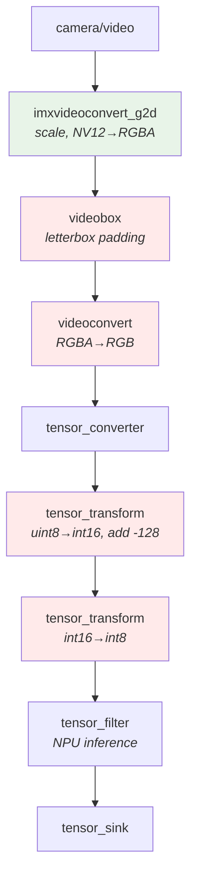
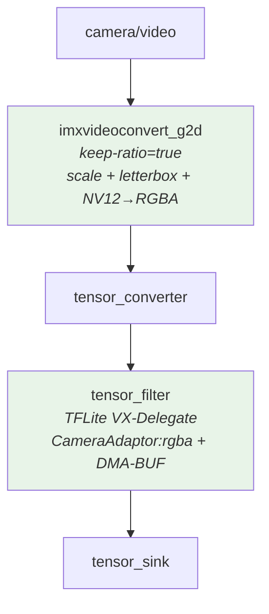
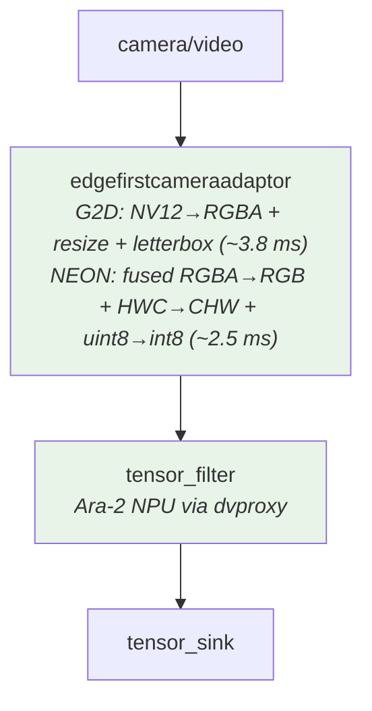
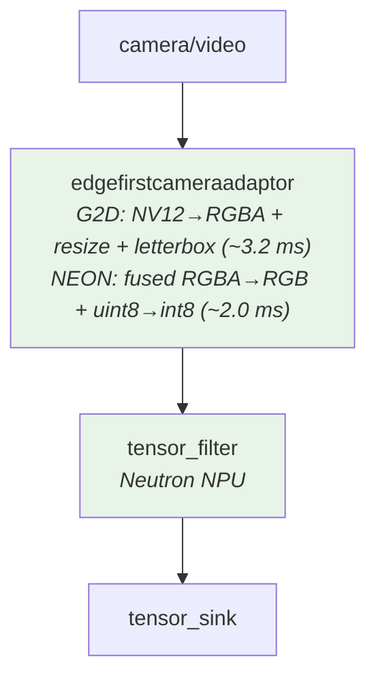
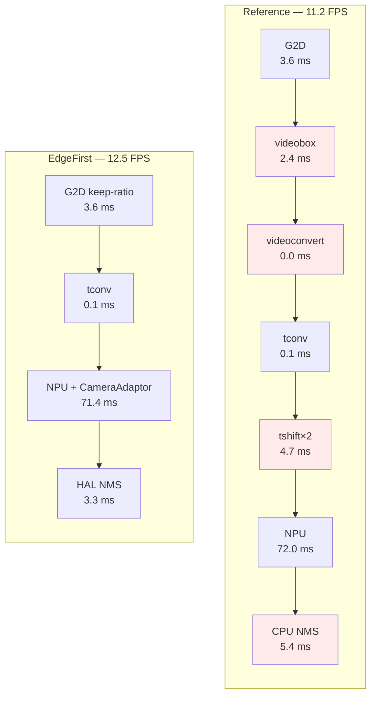
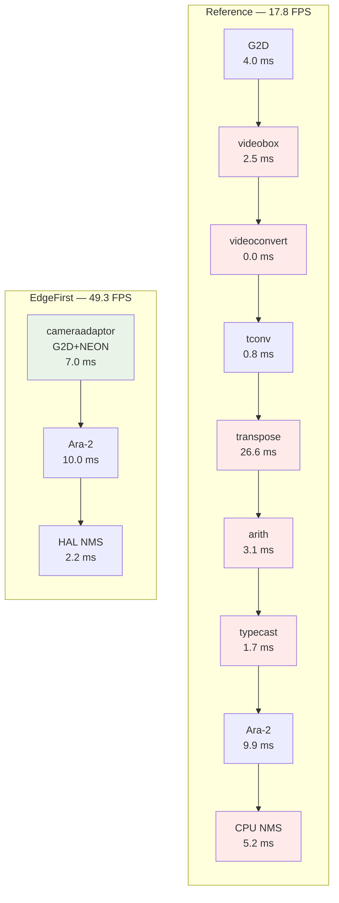
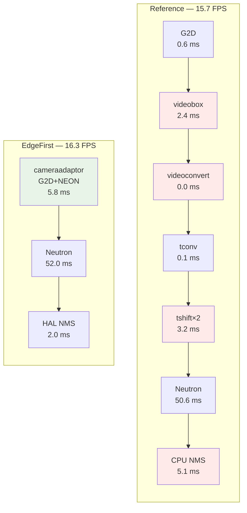

# EdgeFirst Optimized YOLOv8n 640x640

Real-time YOLOv8n object detection on NXP i.MX processors using EdgeFirst-optimized GStreamer pipelines with hardware-accelerated preprocessing, DMA-BUF zero-copy inference, and quantized post-processing.

The `edgefirstcameraadaptor` element is a unified preprocessing element in the `edgefirst-gstreamer` project. It replaces multi-element preprocessing chains with a single element that composes optimized HAL conversion pipelines — hardware-accelerated color conversion and resize via G2D/GPU, fused channel/dtype/layout conversion via NEON SIMD — reducing both pipeline complexity and CPU overhead. The HAL and cameraadaptor will continue to be optimized to further reduce preprocessing times across all platforms.

## Binaries

| Binary | Platform | Key Optimizations |
|--------|----------|-------------------|
| `yolov8n_reference` | i.MX 95 / 8M Plus | Standard NXP pipeline (6-element preprocessing, CPU NMS) |
| `yolov8n_ara2_reference` | Kinara Ara-2 PCIe | Standard NXP pipeline (7-element preprocessing, CPU NMS) |
| `yolov8n_imx8mp` | i.MX 8M Plus VSI | EdgeFirst cameraadaptor + DMA-BUF in VX-Delegate (no NEON fallback) + HAL NMS |
| `yolov8n_ara2` | Kinara Ara-2 PCIe | edgefirstcameraadaptor (G2D + fused NEON RGBA→CHW int8) + HAL NMS |
| `yolov8n_imx95` | i.MX 95 Neutron | edgefirstcameraadaptor (G2D + fused NEON RGBA→RGB int8) + HAL NMS |

---

## Performance Summary

### i.MX 8M Plus (VSI NPU)

| Metric | Reference | EdgeFirst | Improvement |
|--------|-----------|-----------|-------------|
| Preprocessing | 10.89 ms (6 elements) | **3.74 ms** (2 elements) | **-66%** |
| Inference | 72.00 ms | 71.36 ms | ~same |
| Post-processing | 5.43 ms (CPU float NMS) | **3.26 ms** (HAL quant NMS) | **-40%** |
| **E2E Pipeline** | **88.59 ms** | **78.91 ms** | **-11%** |
| **Throughput** | **11.2 FPS** | **12.5 FPS** | **+12%** |

> Preprocessing reduced by 66% through EdgeFirst's cameraadaptor and DMA-BUF optimizations integrated directly into the TFLite VX-Delegate. The EdgeFirst cameraadaptor is integrated into the VX-Delegate via tim-vx graph injection, so the NPU handles RGBA→RGB + uint8→int8 conversion on-chip as part of inference — unlike on the i.MX 95 and Ara-2 where the GStreamer `edgefirstcameraadaptor` element falls back to NEON SIMD for these operations. G2D `keep-ratio=true` fuses scale + letterbox into a single hardware blit, and DMA-BUF zero-copy passes the result directly to the NPU without CPU buffer copies. The GStreamer `edgefirstcameraadaptor` element will replace the current G2D + tensor_converter pipeline once `delegate-preprocessing` support is added, unifying the GStreamer-side interface across all platforms.

### Kinara Ara-2 PCIe NPU (i.MX 8M Plus host)

| Metric | Reference | EdgeFirst | Improvement |
|--------|-----------|-----------|-------------|
| Preprocessing | 38.67 ms (7 elements) | **6.96 ms** (1 element) | **-82%** |
| Inference | 9.91 ms | 10.02 ms | ~same |
| Post-processing | 5.22 ms (CPU float NMS) | **2.18 ms** (HAL quant NMS) | **-58%** |
| **E2E Pipeline** | **54.66 ms** | **20.30 ms** | **-63%** |
| **Throughput** | **17.8 FPS** | **49.3 FPS** | **+177%** |

> The reference pipeline spends 38.67 ms on 7 CPU preprocessing elements — the NNStreamer CHW transpose alone takes 26.6 ms. The `edgefirstcameraadaptor` fuses all operations into a single element: G2D hardware handles NV12→RGBA + resize + letterbox (~3.8 ms via DMA-BUF blit), then a NEON kernel fuses RGBA→RGB extraction, HWC→CHW deinterleave, and uint8→int8 quantization in a single pass (~2.5 ms). EdgeFirst Ara-2 enablement supports full DMA-BUF through to dvproxy (the internals of dvproxy are not documented so we cannot comment on what happens there). There is currently an issue with the OpenGL HWC→CHW conversion path, so NEON handles the layout transpose along with the RGBA→RGB and uint8→int8 conversions. Similar to how we optimized the TFLite VX-Delegate on the i.MX 8M Plus with CameraAdaptor graph injection via tim-vx, cameraadaptor graph injection into the Ara-2 dvproxy could further optimize preprocessing if similar access is granted.
>
> **i.MX 95 host**: The Ara-2 is also supported on the i.MX 95 platform but we are currently investigating a driver issue and do not have up-to-date benchmarks with the latest EdgeFirst optimizations. The Ara-2 was previously tested on i.MX 95 but not benchmarked with the current `edgefirstcameraadaptor`.

### i.MX 95 (Neutron NPU)

| Metric | Reference | EdgeFirst | Improvement |
|--------|-----------|-----------|-------------|
| Preprocessing | 6.42 ms (6 elements) | **5.75 ms** (1 element) | **-10%** |
| Inference | 50.64 ms | 52.01 ms | ~same |
| Post-processing | 5.09 ms (CPU float NMS) | **1.98 ms** (HAL quant NMS) | **-61%** |
| **Throughput** | **15.7 FPS** | **16.3 FPS** | **+4%** |

> These are initial optimizations and we expect further improvements. The reference preprocessing is notably faster on the i.MX 95 (6.42 ms) than on the i.MX 8M Plus (10.89 ms), which means there is less headroom to improve — but we still reduce it by 10% while replacing 6 pipeline elements with one. The current TFLite delegate for the Neutron NPU does not support full DMA-BUF input or graph injection, so the GStreamer `edgefirstcameraadaptor` element must use NEON SIMD fallback for RGBA→RGB + uint8→int8 conversion. On the i.MX 8M Plus, the EdgeFirst cameraadaptor is integrated directly into the VX-Delegate (no NEON fallback needed), which is how preprocessing reaches 3.74 ms there. Once Neutron DMA-BUF and graph injection support become available, we expect to bring i.MX 95 preprocessing into the ~2 ms range. The HAL quantized NMS already provides a significant improvement, reducing post-processing by 61%.

### Fused Operations per Platform

| Platform | Model Format | edgefirstcameraadaptor Fused Operations |
|----------|-------------|----------------------------------------|
| **i.MX 8M Plus VSI** | HWC uint8 | *EdgeFirst cameraadaptor + DMA-BUF integrated into VX-Delegate (RGBA→RGB + uint8→int8 on NPU, no NEON fallback)* |
| **Kinara Ara-2** | CHW int8 | NV12→RGBA (G2D) + fused RGBA→RGB + HWC→CHW + uint8→int8 (NEON) |
| **i.MX 95 Neutron** | HWC int8 | NV12→RGBA (G2D) + fused RGBA→RGB + uint8→int8 (NEON) |

Test configuration: YOLOv8n 640x640 INT8, 1920x1080 H.264 video input with looping, headless output, 120-second runs (1000+ frames), Yocto 6.12.49-2.2.0.

---

## Pipeline Architectures

### Reference Pipeline (All Platforms)

The standard NXP pipeline uses 6 CPU preprocessing elements before NPU inference, followed by manual float dequantization and per-class NMS. Ara-2 requires an additional transpose stage (7 total) because the model expects CHW layout.



> Green = hardware accelerated, Red = CPU-bound stages eliminated by EdgeFirst

### EdgeFirst: i.MX 8M Plus (cameraadaptor in VX-Delegate + DMA-BUF)

Reduces preprocessing from 6 elements to 2. The EdgeFirst cameraadaptor is integrated directly into the TFLite VX-Delegate via tim-vx graph injection — the NPU handles RGBA→RGB + uint8→int8 conversion on-chip as part of inference, so the GStreamer `edgefirstcameraadaptor` element does not need to use NEON fallback like it does on the i.MX 95 and Ara-2. G2D `keep-ratio=true` fuses scale + letterbox into a single hardware blit, and DMA-BUF zero-copy passes the result directly to the NPU without CPU buffer copies. This is the most optimized path, achieving 3.74 ms preprocessing.



### EdgeFirst: Kinara Ara-2 (edgefirstcameraadaptor)

The `edgefirstcameraadaptor` element handles all preprocessing in a single GStreamer element. The HAL's G2D backend performs NV12→RGBA conversion, resize, and letterbox via DMA-BUF hardware blit. A fused NEON kernel then performs RGBA→RGB channel extraction, HWC→CHW layout transpose, and uint8→int8 quantization in a single pass. Full DMA-BUF is maintained through to the Ara-2 dvproxy.



**Pipeline string:**
```
edgefirstcameraadaptor model-width=640 model-height=640 model-dtype=int8 model-layout=chw letterbox=true
! tensor_filter framework=ara2 model=MODEL custom=EnableStats:true latency=1
! tensor_sink
```

### EdgeFirst: i.MX 95 (edgefirstcameraadaptor)

Replaces the entire 6-element preprocessing chain with a single `edgefirstcameraadaptor` element. G2D hardware handles NV12→RGBA + resize + letterbox, then a fused NEON kernel performs RGBA→RGB + uint8→int8 in a single pass. This is the initial optimization; further improvements are expected once the Neutron TFLite delegate supports DMA-BUF input and graph injection.



**Pipeline string:**
```
edgefirstcameraadaptor model-width=640 model-height=640 model-dtype=int8 model-layout=hwc letterbox=true
! tensor_filter framework=tensorflow-lite model=MODEL
    custom=Delegate:External,ExtDelegateLib:libneutron_delegate.so latency=1
! tensor_sink
```

---

## Stage-by-Stage Breakdown

### i.MX 8M Plus (VSI NPU)

| Stage | Reference | EdgeFirst | Improvement |
|-------|-----------|-----------|-------------|
| **Preprocessing** | **10.89 ms** (6 elements) | **3.74 ms** (2 elements) | **-66%** |
| G2D Scale + Colorspace | 3.57 ms | 3.62 ms (+ fused letterbox) | ~same |
| Letterbox (videobox) | 2.45 ms | *eliminated* (G2D keep-ratio) | -2.45 ms |
| Colorspace (videoconvert) | 0.01 ms | *eliminated* | |
| Tensor converter | 0.11 ms | 0.12 ms | ~same |
| Tensor transforms (×2) | 4.75 ms | *eliminated* (NPU CameraAdaptor) | -4.75 ms |
| **Inference** | **72.00 ms** | **71.36 ms** | ~same |
| **Post-processing** | **5.43 ms** (CPU float NMS) | **3.26 ms** (HAL quant NMS) | **-40%** |
| **Throughput** | **11.2 FPS** | **12.5 FPS** | **+12%** |



### Kinara Ara-2 (i.MX 8M Plus PCIe)

| Stage | Reference | EdgeFirst | Improvement |
|-------|-----------|-----------|-------------|
| **Preprocessing** | **38.67 ms** (7 elements) | **6.96 ms** (1 element) | **-82%** |
| G2D NV12→RGBA + resize | 4.0 ms | | |
| Letterbox (videobox) | 2.5 ms | | |
| videoconvert + tconv | 0.8 ms | *eliminated* | |
| Tensor transpose (CHW) | 26.6 ms | *eliminated* | |
| Tensor arith + typecast | 4.8 ms | *eliminated* | |
| edgefirstcameraadaptor | — | 6.96 ms (fused) | |
| **Inference (Ara-2)** | **9.91 ms** | **10.02 ms** | ~same |
| **Post-processing** | **5.22 ms** (CPU float NMS) | **2.18 ms** (HAL quant NMS) | **-58%** |
| **E2E Pipeline** | **54.66 ms** | **20.30 ms** | **-63%** |
| **Throughput** | **17.8 FPS** | **49.3 FPS** | **+177%** |

edgefirstcameraadaptor internal timing (per-frame `clock_gettime`, DMA-BUF input):
- G2D: NV12→RGBA + resize + letterbox: ~3.8 ms
- NEON: fused RGBA→RGB + HWC→CHW + uint8→int8: ~2.5 ms



> The NNStreamer CHW transpose (26.6 ms) is the single largest bottleneck in the reference pipeline. The NEON `rgba_to_planar_i8` kernel eliminates it entirely by fusing RGBA→RGB extraction, HWC→CHW deinterleave, and uint8→int8 XOR in a single pass (~2.5 ms). The HWC→CHW conversion would ideally be handled by the OpenGL backend for further acceleration, but there is currently an issue with this path so NEON handles it along with the RGBA→RGB and uint8→int8 conversions.

### i.MX 95 (Neutron NPU)

| Stage | Reference | EdgeFirst | Improvement |
|-------|-----------|-----------|-------------|
| **Preprocessing** | **6.42 ms** (6 elements) | **5.75 ms** (1 element) | **-10%** |
| G2D NV12→RGBA + resize | 0.65 ms | | |
| Letterbox (videobox) | 2.41 ms | | |
| videoconvert + tconv | 0.17 ms | *eliminated* | |
| Tensor transforms (×2) | 3.19 ms | *eliminated* | |
| edgefirstcameraadaptor | — | 5.75 ms (fused) | |
| **Inference (Neutron)** | **50.64 ms** | **52.01 ms** | ~same |
| **Post-processing** | **5.09 ms** (CPU float NMS) | **1.98 ms** (HAL quant NMS) | **-61%** |
| **Throughput** | **15.7 FPS** | **16.3 FPS** | **+4%** |

edgefirstcameraadaptor internal timing (per-frame `clock_gettime`, DMA-BUF input):
- G2D: NV12→RGBA + resize + letterbox: ~3.2 ms
- NEON: fused RGBA→RGB + uint8→int8: ~2.0 ms



> **Initial optimizations** — the i.MX 95 reference preprocessing (6.42 ms) is already significantly faster than the i.MX 8M Plus reference (10.89 ms), leaving less headroom to improve. The `edgefirstcameraadaptor` still reduces preprocessing by 10% while consolidating 6 elements into one, and the HAL quantized NMS reduces post-processing by 61%. However, the i.MX 8M Plus achieves 3.74 ms preprocessing through DMA-BUF zero-copy input to the NPU and CameraAdaptor:rgba graph injection — neither of which the Neutron TFLite delegate currently supports. Once DMA-BUF and graph injection are available for Neutron, we expect to bring i.MX 95 preprocessing into the ~2 ms range, surpassing the i.MX 8M Plus.

---

## edgefirstcameraadaptor Technical Details

### Architecture

The `edgefirstcameraadaptor` element composes an optimized preprocessing pipeline using the EdgeFirst HAL. It uses a two-stage architecture with an RGBA u8 intermediate:

| Stage | Hardware | Operations | Latency (DMA-BUF input) |
|-------|----------|-----------|------------------------|
| **Stage 1** | G2D (hardware DMA) | NV12→RGBA + resize + letterbox | ~3.2-3.8 ms |
| **Stage 2** | NEON SIMD | Fused channel/layout/dtype conversion | ~2.0-2.5 ms |

**Stage 1** calls `hal_image_processor_convert()` with an owned `hal_tensor_image` destination, which engages the HAL's hardware cascade (G2D → GPU → CPU fallback). The RGBA u8 intermediate is 4-byte aligned and compatible with all hardware backends. With DMA-BUF input from `v4l2h264dec`, G2D performs a hardware-to-hardware DMA blit.

**Stage 2** applies a single fused NEON kernel that combines multiple operations in one pass:

| Kernel | Fused Operations | Platform |
|--------|-----------------|----------|
| `rgba_to_rgb_i8` | RGBA→RGB alpha strip + uint8→int8 | i.MX 95 (HWC int8) |
| `rgba_to_planar_i8` | RGBA→RGB + HWC→CHW + uint8→int8 | Kinara Ara-2 (CHW int8) |
| `rgba_to_rgb_u8` | RGBA→RGB alpha strip | HWC uint8 models |
| `rgba_to_planar_u8` | RGBA→RGB + HWC→CHW | CHW uint8 models |
| `rgba_to_rgb_f32` | RGBA→RGB + uint8→float32 + normalize | HWC float models |
| `rgba_to_planar_f32` | RGBA→RGB + HWC→CHW + uint8→float32 + normalize | CHW float models |

All kernels have AArch64 NEON fast paths with scalar C fallback for desktop builds. BGR channel ordering is handled by swapping NEON register assignments before store (zero extra cost).

### Element Properties

```
model-width=640         Model input width
model-height=640        Model input height
model-dtype=int8        Output dtype: uint8, int8, float32
model-layout=hwc        Output layout: hwc, chw
model-colorspace=rgb    Output colorspace: rgb, bgr, grey
letterbox=true          Enable aspect-preserving letterbox
```

Letterbox parameters are computed at caps negotiation and readable at runtime:

```cpp
gfloat scale; gint top, left;
g_object_get(cameraadaptor, "letterbox-scale", &scale,
             "letterbox-top", &top, "letterbox-left", &left, NULL);
```

### Future Optimizations

The HAL and cameraadaptor will continue to be optimized:
- **Graph injection / delegate-preprocessing**: On the i.MX 8M Plus, the EdgeFirst cameraadaptor is already integrated into the VX-Delegate via tim-vx, eliminating NEON fallback entirely. For the Ara-2 dvproxy and Neutron delegate, similar graph injection could eliminate the NEON Stage 2 on those platforms as well
- **DMA-BUF zero-copy output**: For output formats that match the hardware intermediate, the HAL can pass the DMA-BUF directly to the NPU without CPU copies
- **GPU shader-based conversion**: On platforms with OpenGL ES support, the GPU can perform the full conversion including HWC→CHW layout transpose in a single render pass (currently investigating a driver issue on the Vivante GPU)
- **Neutron DMA-BUF + graph injection**: Once the Neutron TFLite delegate supports full DMA-BUF input and graph injection, the EdgeFirst cameraadaptor can be integrated into the Neutron delegate the same way it is in the VX-Delegate on the i.MX 8M Plus, eliminating the NEON fallback on i.MX 95

---

## EdgeFirst HAL Post-Processing

All EdgeFirst binaries use `libedgefirst_hal.so` for post-processing:

- Operates directly on INT8/INT16 output tensors without float dequantization
- Performs confidence thresholding and NMS in the quantized domain
- Uses Rayon-parallel processing for multi-core acceleration

For TFLite models (i.MX 95, 8M Plus), the HAL is initialized with inline JSON config describing the combined `[1, 84, 8400]` INT8 output tensor. For Ara-2, the HAL reads split tensor metadata from an EdgeFirst YAML config file.

---

## Building

### Prerequisites

Build the Yocto SDK and target image following the **EdgeFirst for i.MX User Manual** (Yocto Integration section). The SDK includes all required dependencies: NNStreamer, GStreamer, EdgeFirst HAL (`libedgefirst_hal.so`), and the EdgeFirst GStreamer plugin (`libgstedgefirsthal.so`) with the `edgefirstcameraadaptor` element.

### Cross-Compile

```bash
cd yolov8n

# i.MX 8M Plus
source <yocto-sdk-imx8mp>/environment-setup-armv8a-poky-linux
mkdir -p build-imx8mp && cd build-imx8mp
cmake .. && make yolov8n_reference yolov8n_imx8mp yolov8n_ara2 yolov8n_ara2_reference

# i.MX 95
source <yocto-sdk-imx95>/environment-setup-armv8a-poky-linux
mkdir -p build-imx95 && cd build-imx95
cmake .. && make yolov8n_reference yolov8n_imx95
```

---

## Running

### Examples

#### i.MX 8M Plus

```bash
# Reference baseline
yolov8n_reference -m yolov8n_640x640.tflite -c /dev/video3 --platform imx8mp -H -I

# EdgeFirst (G2D + CameraAdaptor + DMA-BUF)
yolov8n_imx8mp -m yolov8n_640x640.tflite -c /dev/video3 -H -I -n 1000
```

#### Ara-2

```bash
# Reference baseline
timeout -s INT 120 yolov8n_ara2_reference -m yolov8n.dvm -v video.mp4

# EdgeFirst (edgefirstcameraadaptor)
timeout -s INT 120 yolov8n_ara2 -m yolov8n.dvm -v video.mp4 -c edgefirst.yaml
```

#### i.MX 95

```bash
# Reference baseline
yolov8n_reference -m yolov8n_640x640_converted.tflite --platform imx95 -H -I

# EdgeFirst (edgefirstcameraadaptor)
yolov8n_imx95 -m yolov8n_640x640_converted.tflite -H -I

# Benchmark (120-second run)
timeout -s INT 120 yolov8n_imx95 -m yolov8n_640x640_converted.tflite -v video.mp4 -H -I
```

### Command-Line Options

```
-m, --model <path>        Model file (required)
-c, --camera <device>     Camera device (default: platform-specific)
-v, --video <file>        Video file input (H.264 MP4)
-i, --image <file>        Static image input (JPEG)
-I, --instrumented        Detailed timing breakdown (EdgeFirst binaries)
-H, --headless            No display output
-n, --frames <N>          Stop after N frames (0=infinite)
--platform imx95|imx8mp   Platform selection (reference binary only)
```

---

## Benchmarking Methodology

1. **Video file input** with looping — eliminates camera frame rate variability
2. **Headless mode** (`tensor_sink`) — removes display/rendering overhead
3. **120-second timeout** with `timeout -s INT` — sends SIGINT for clean summary
4. **Per-stage timing** via GStreamer pad probes (`gettimeofday` on sink/src pads)
5. **NPU inference** from `tensor_filter` `latency` property (10-frame moving average)
6. **E2E pipeline** via PTS-correlated timestamps (preproc input to post-processing complete)
7. **Timing validation** — sum of stages covers >98% of measured E2E latency

---

## Model Information

### TFLite (i.MX 95, i.MX 8M Plus)

| Parameter | Value |
|-----------|-------|
| Model | YOLOv8n 640×640 INT8 quantized |
| Output Shape | [1, 84, 8400] (4 coords + 80 classes, column-major) |
| Output Scale | 0.00390632 |
| Output Zero Point | -128 |

**i.MX 8M Plus (VSI):** Uses the standard `.tflite` model directly.

**i.MX 95 (Neutron):** Requires conversion with `neutron-converter` from the eIQ Toolkit. Input model is the standard Ultralytics INT8 TFLite export.

### Ara-2 (DVM format)

| Parameter | Value |
|-----------|-------|
| Model | YOLOv8n 640×640 INT8 (Kinara DVM) |
| Output 0 (scores) | uint8 [80, 8400], qn=0.003906 |
| Output 1 (boxes) | int16 [4, 8400], qn=0.019824, signed |

---

## Troubleshooting

**G2D errors** (`g2d_open: Init Dpu Handle fail !`): Check `/dev/dpu*` `/dev/g2d*` device nodes exist and no other process is using G2D. Run as root.

**Wayland display:** Start Weston (`weston &`), set `WAYLAND_DISPLAY=wayland-0` and `XDG_RUNTIME_DIR=/run/user/0`.

**i.MX 95 garbage detections:** Set `NEUTRON_ENABLE_ZERO_COPY=0`.

**EdgeFirst HAL errors:** Ensure `libedgefirst_hal.so` is installed. For TFLite models, the HAL tensor shape must be 3D `[1, 84, 8400]`. For Ara-2, the YAML config must use split format with `type: scores` and `type: boxes` entries.

**Ara-2 connection:** Verify PCIe enumeration (`lspci | grep -i kinara`), check that the `ara2` service is running (`systemctl status ara2`), and confirm the NNStreamer sub-plugin is registered (`gst-inspect-1.0 tensor_filter | grep ara2`).

**edgefirstcameraadaptor not found:** Ensure the rebuilt `libgstedgefirsthal.so` and `libedgefirst_hal.so` are deployed. Delete stale GStreamer registry: `rm /tmp/gstreamer-1.0/registry.*.bin`.
